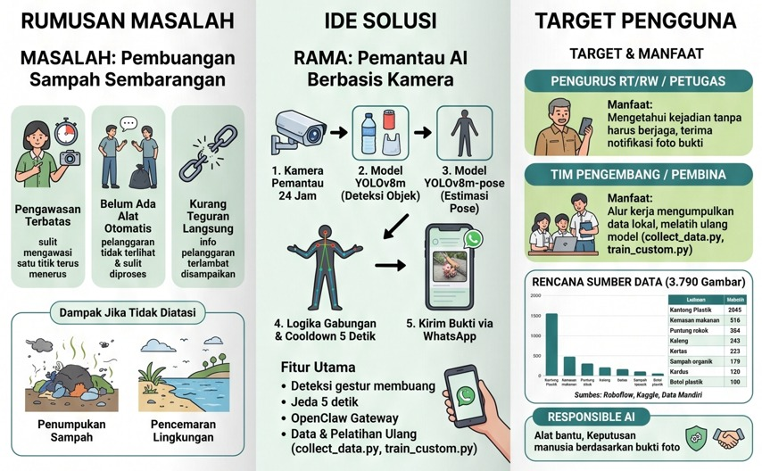
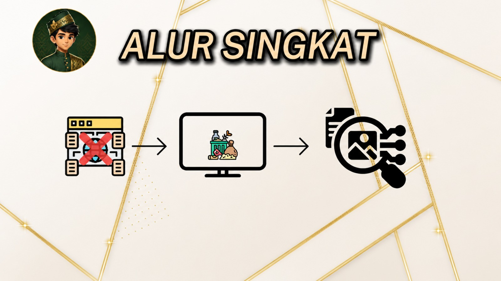
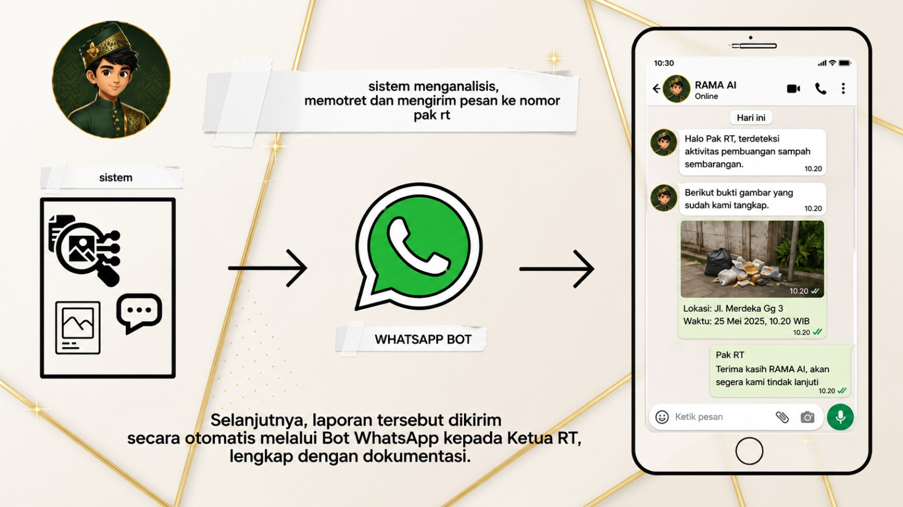
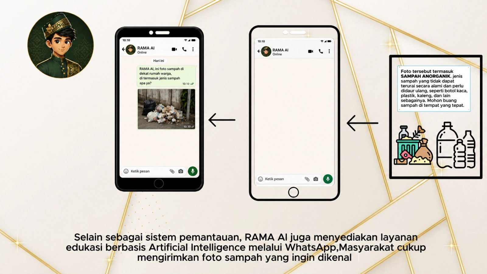
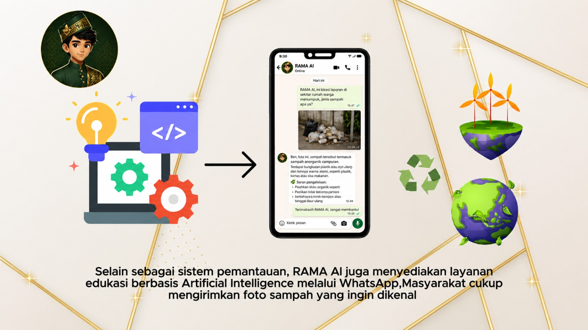

<div align="center">
  
  <h1>RAMA AI</h1>
  <p><strong>Pemantau AI Berbasis Kamera untuk Deteksi Pembuangan Sampah Sembarangan</strong></p>
  <p>Project LKS Kecerdasan Buatan AI Eksebisi</p>
</div>

RAMA AI adalah prototipe sistem pemantauan lingkungan berbasis Artificial Intelligence untuk mendeteksi aktivitas pembuangan sampah sembarangan secara real-time melalui kamera. Sistem ini memadukan Computer Vision, deteksi objek, pose estimation, dan laporan otomatis melalui WhatsApp agar pelanggaran dapat terdokumentasi dengan bukti foto.

## Media Sosial dan Video Penjelasan

- Instagram RAMA AI: [@rama.assistant](https://www.instagram.com/rama.assistant/)
- WhatsApp uji coba RAMA AI: [+62 851-8275-5853](https://wa.me/6285182755853)
- Video penjelasan project: [Instagram Reel RAMA AI](https://www.instagram.com/reel/DaVkCzAyWYm/?utm_source=ig_web_copy_link&igsh=MzRlODBiNWFlZA==)

## Dokumentasi Visual

Gambar berikut adalah materi visual utama yang digunakan untuk menjelaskan masalah, solusi, alur sistem, target pengguna, serta fitur WhatsApp RAMA AI.











> Catatan: simpan gambar presentasi ke folder `assets/readme/` dengan nama file yang sama seperti path di atas agar gambar tampil di GitHub.

## Persona RAMA

RAMA digambarkan sebagai asisten AI yang ramah, edukatif, dan dekat dengan masyarakat. Avatar RAMA digunakan sebagai identitas visual pada materi presentasi dan simulasi WhatsApp sehingga sistem tidak terasa seperti alat pengawasan yang kaku, tetapi seperti asisten lingkungan yang membantu warga dan pengurus RT/RW.

Peran persona RAMA:

- Menjadi wajah utama sistem pada dokumentasi dan demo.
- Membuat fitur WhatsApp terasa lebih mudah dipahami masyarakat.
- Menguatkan branding project sebagai solusi AI yang edukatif.
- Menjelaskan hasil analisis sampah dengan bahasa sederhana.

## Latar Belakang

Pembuangan sampah sembarangan masih menjadi masalah yang sering terjadi di lingkungan masyarakat. Proses pengawasan manual membutuhkan waktu, tenaga, dan sering kali tidak memiliki bukti visual yang cukup ketika pelanggaran terjadi.

RAMA AI hadir sebagai solusi berbasis AI yang dapat membantu pengawasan lingkungan secara otomatis. Sistem membaca gambar dari kamera, menganalisis keberadaan sampah, mendeteksi gestur manusia yang mengarah pada aktivitas membuang atau menjatuhkan objek, lalu mengirimkan bukti gambar ke nomor WhatsApp yang ditentukan.

## Rumusan Masalah

Berdasarkan kebutuhan pengawasan lingkungan, masalah utama yang ingin diselesaikan adalah pembuangan sampah sembarangan. Masalah tersebut muncul karena:

- Pengawasan terbatas dan sulit memantau satu titik secara terus-menerus.
- Belum ada alat otomatis yang dapat mendeteksi pelanggaran secara real-time.
- Informasi pelanggaran sering terlambat diterima pihak yang bertanggung jawab.
- Bukti kejadian sulit dikumpulkan jika hanya mengandalkan laporan manual.

Dampaknya, sampah dapat menumpuk, lingkungan menjadi tercemar, dan tindak lanjut menjadi lambat karena tidak ada dokumentasi kejadian yang jelas.

## Tujuan

- Membantu mendeteksi aktivitas pembuangan sampah sembarangan secara real-time.
- Menghasilkan dokumentasi visual berupa foto bukti saat potensi pelanggaran terdeteksi.
- Mengirimkan laporan otomatis melalui WhatsApp kepada pihak terkait, seperti Ketua RT.
- Menyediakan dasar sistem edukasi dan pengawasan lingkungan berbasis AI.

## Ide Solusi

RAMA AI dirancang sebagai sistem pemantau berbasis kamera yang bekerja melalui beberapa tahap:

1. Kamera memantau area lingkungan selama sistem aktif.
2. Model YOLOv8m mendeteksi objek yang berpotensi menjadi sampah.
3. Model YOLOv8m-pose membaca pose manusia untuk mengenali gestur membuang.
4. Logika gabungan dan cooldown digunakan agar laporan tidak terkirim terlalu sering.
5. Bukti foto dikirim melalui WhatsApp kepada pihak yang bertugas.

Selain fitur pemantauan RT/RW, RAMA AI juga dapat dikembangkan menjadi fitur edukasi warga. Warga dapat mengirim foto sampah melalui WhatsApp, lalu sistem membantu mengenali jenis sampah dan memberi saran pengelolaan.

## Target Pengguna

| Pengguna | Manfaat |
| --- | --- |
| Pengurus RT/RW atau petugas lingkungan | Mengetahui kejadian tanpa harus berjaga terus-menerus dan menerima notifikasi foto bukti. |
| Tim pengembang atau pembina | Mengumpulkan data lokal, melatih ulang model, dan meningkatkan akurasi sistem. |
| Warga masyarakat | Mendapat edukasi jenis sampah dan cara pengelolaan melalui WhatsApp. |

Project ini tetap mengikuti prinsip Responsible AI: sistem berperan sebagai alat bantu, sedangkan keputusan akhir tetap dilakukan manusia berdasarkan bukti foto dan konteks lapangan.

## Fitur Utama

- Deteksi objek sampah menggunakan YOLO.
- Deteksi pose manusia untuk mengenali gestur membuang atau menjatuhkan sampah.
- Validasi ganda antara objek sampah dan gestur agar deteksi lebih relevan.
- Deteksi sampah menetap berdasarkan durasi kemunculan di kamera.
- Pemrosesan kamera secara real-time dengan thread terpisah agar tampilan tetap responsif.
- Capture bukti otomatis saat kejadian terkonfirmasi.
- Pengiriman foto bukti melalui WhatsApp menggunakan OpenClaw CLI.
- Mode diagnostik dengan bounding box, confidence score, dan titik pose.
- Dukungan pengumpulan data kamera untuk menambah dataset baru.
- Dukungan pelatihan ulang model YOLO menggunakan dataset custom.

## Alur Kerja Sistem

1. Kamera menangkap video secara real-time.
2. Frame diproses oleh model YOLO untuk mendeteksi objek yang berpotensi menjadi sampah.
3. Sistem menjalankan pose estimation untuk membaca gerakan tangan manusia.
4. Deteksi dikonfirmasi jika:
   - sampah terlihat dan gestur membuang/menjatuhkan terdeteksi, atau
   - sampah terlihat terus-menerus melebihi durasi tertentu.
5. Sistem menyimpan gambar bukti ke file `test_capture.jpg`.
6. Foto bukti dikirim otomatis ke WhatsApp melalui OpenClaw.
7. Pihak terkait menerima laporan dan dapat melakukan tindak lanjut.

## Teknologi yang Digunakan

- Python
- OpenCV
- Ultralytics YOLO
- YOLOv8 Object Detection
- YOLOv8 Pose Estimation
- OpenClaw CLI untuk pengiriman WhatsApp
- Model bahasa `qweb:14b` pada OpenClaw yang sudah diberi prompt khusus sesuai kebutuhan RAMA AI
- Server sekolah sebagai layanan pendukung untuk menjalankan integrasi OpenClaw dan model bahasa
- Dataset gambar sampah dalam format YOLO

## Model AI

Project ini menggunakan beberapa model:

| Model | Fungsi |
| --- | --- |
| `yolov8m.pt` | Deteksi objek umum berbasis dataset COCO |
| `yolov8m-pose.pt` | Deteksi pose manusia |
| `turhancan97/yolov8-segment-trash-detection` | Model tambahan untuk deteksi sampah/litter |

Model akan dimuat melalui library Ultralytics. Jika model belum tersedia di komputer, Ultralytics dapat mengunduh model saat pertama kali dijalankan.

## Struktur Project

```text
RamaAI/
|-- collect_data.py          # Mengambil gambar dari kamera untuk dataset baru
|-- config.json              # Konfigurasi model, WhatsApp, confidence, dan cooldown
|-- openclaw_api.py          # Integrasi pengiriman gambar melalui OpenClaw CLI
|-- train_custom.py          # Script pelatihan ulang model YOLO
|-- yolo_detector.py         # Program utama deteksi real-time
+-- datasets/
    |-- raw/                 # Dataset mentah beberapa kategori sampah
    +-- smart_waste_dataset/ # Dataset smart waste
```

## Dataset

Folder `datasets/raw` berisi beberapa kategori data sampah, antara lain:

- `can`
- `cardboard`
- `cigarettes`
- `food_wrapper`
- `organic`
- `paper`
- `plastic_bag`
- `plastic_bottle`

Sebagian dataset sudah memiliki file `data.yaml` dengan format YOLO, misalnya:

- `datasets/raw/can/data.yaml`
- `datasets/raw/cigarettes/cigarette.v3i.yolov11/data.yaml`
- `datasets/raw/food_wrapper/data.yaml`
- `datasets/raw/organic/data.yaml`
- `datasets/raw/plastic_bag/data.yaml`

### Sumber Dataset

Sumber dataset berikut diambil dari file metadata bawaan dataset seperti `README.dataset.txt`, `README.roboflow.txt`, dan `data.yaml`.

| Kategori | Sumber | Jumlah gambar | Format | Lisensi/Catatan |
| --- | --- | ---: | --- | --- |
| Kaleng | [Roboflow - dataset ademsari kaleng](https://universe.roboflow.com/unkn0wn/dataset-ademsari-kaleng/dataset/1) | 243 | YOLOv11 | CC BY 4.0 |
| Puntung rokok | [Roboflow - cigarette](https://universe.roboflow.com/study-iksue/cigarette-7yeus/dataset/3) | 364 | YOLOv11 | CC BY 4.0 |
| Kemasan makanan | [Roboflow - snack](https://universe.roboflow.com/king-mongkuts-university-of-technology-north-bangkok-mskv3/snack-ubufj/dataset/1) | 516 | YOLOv11 | CC BY 4.0 |
| Sampah organik | [Roboflow - organic](https://universe.roboflow.com/mohamed-awad/organic-wjqwd/dataset/7) | 179 | YOLOv11 | CC BY 4.0 |
| Kantong plastik | [Roboflow - plastik kresek](https://universe.roboflow.com/coba-j6eos/plastik-kresek/dataset/3) | 2045 | YOLOv11 | CC BY 4.0 |
| Kertas | [Roboflow - Waste classification Paper](https://universe.roboflow.com/trash-tech-9qc7i/waste-classification-paper) | 224 | Folder format | CC BY 4.0 |
| Kardus | Kaggle/DataCluster, berdasarkan path anotasi lokal `kaggle datasets/cardboard` | 120 | Pascal VOC XML | Metadata URL/lisensi tidak tersedia di folder dataset |
| Botol plastik | DataCluster Bottles and Cups, berdasarkan nama file dan path anotasi lokal | 100 | Pascal VOC XML | Metadata URL/lisensi tidak tersedia di folder dataset |

Catatan: jumlah gambar mengikuti metadata dataset yang tersedia di dalam folder masing-masing. Pada materi presentasi, jumlah gambar kertas diringkas menjadi 223, sedangkan metadata Roboflow pada repository mencatat 224 gambar.

## Persyaratan

- Python 3.10 atau lebih baru
- Kamera/webcam
- Koneksi internet saat pertama kali mengunduh model YOLO
- OpenClaw CLI jika ingin menggunakan fitur kirim WhatsApp
- WhatsApp target yang sudah dikonfigurasi

## Instalasi

Masuk ke folder project:

```powershell
cd "C:\Python Env\Project New\RamaAI"
```

Buat virtual environment:

```powershell
python -m venv .venv
.\.venv\Scripts\activate
```

Install dependency utama:

```powershell
python -m pip install --upgrade pip
pip install ultralytics opencv-python
```

Jika menggunakan GPU NVIDIA, pastikan instalasi PyTorch sudah sesuai dengan versi CUDA yang digunakan.

## Konfigurasi

Konfigurasi utama berada di file `config.json`.

```json
{
    "openclaw_url": "http://127.0.0.1:18789",
    "openclaw_token": "ganti_dengan_token_openclaw",
    "whatsapp_number": "+628xxxxxxxxxx",
    "yolo_model_path": "yolov8m.pt",
    "detection_confidence": 0.5,
    "pose_confidence": 0.6,
    "cooldown_seconds": 5
}
```

Keterangan:

| Key | Fungsi |
| --- | --- |
| `openclaw_url` | Alamat service OpenClaw |
| `openclaw_token` | Token autentikasi OpenClaw |
| `whatsapp_number` | Nomor WhatsApp penerima laporan |
| `yolo_model_path` | Model YOLO utama untuk deteksi objek |
| `detection_confidence` | Ambang confidence deteksi objek |
| `pose_confidence` | Ambang confidence deteksi pose |
| `cooldown_seconds` | Jeda minimal antar pengiriman laporan |

Catatan: jangan gunakan token asli untuk repository publik. Ganti nilai token dan nomor WhatsApp sesuai kebutuhan demo.

## Menjalankan Deteksi Real-Time

Jalankan program utama:

```powershell
python yolo_detector.py
```

Saat program berjalan:

- Kamera akan terbuka.
- Terminal menampilkan objek yang dilihat AI.
- Window diagnostik menampilkan bounding box dan status deteksi.
- Tekan tombol `q` pada window kamera untuk keluar.

Jika aktivitas pembuangan sampah terdeteksi, sistem akan:

- mengambil frame bukti,
- menyimpan gambar ke `test_capture.jpg`,
- mengirim gambar ke nomor WhatsApp pada `config.json`.

## Fitur WhatsApp

Integrasi WhatsApp pada RAMA AI menggunakan OpenClaw yang berjalan melalui server sekolah. Pada sisi pemrosesan bahasa, OpenClaw menggunakan model `qweb:14b` yang sudah diberi prompt khusus agar respons menyesuaikan tugas RAMA AI, seperti pelaporan kejadian ke Ketua RT dan edukasi pemilahan sampah untuk warga.

Detail alamat server, token, dan kredensial tidak dituliskan di README publik agar konfigurasi tetap aman.

### Chat RT

Fitur Chat RT berfungsi sebagai jalur notifikasi untuk pengurus lingkungan. Alurnya:

1. Kamera memantau area.
2. AI mendeteksi objek sampah dengan YOLO.
3. Sistem mengidentifikasi potensi pelanggaran.
4. Foto bukti diambil otomatis.
5. Bukti dikirim melalui bot WhatsApp.
6. Ketua RT menerima laporan dan melakukan tindak lanjut.

### Chat AI Edukasi

Fitur Chat AI berfungsi sebagai sarana edukasi masyarakat. Alurnya:

1. Warga membuka chat WhatsApp RAMA AI.
2. Warga mengirim foto sampah.
3. AI menganalisis jenis sampah.
4. Sistem memberikan penjelasan dan saran pengelolaan.

Fitur ini membuat RAMA AI tidak hanya menjadi sistem pemantauan, tetapi juga media pembelajaran pemilahan sampah yang mudah diakses warga.

## Mengumpulkan Dataset Baru

Gunakan script berikut untuk mengambil gambar dari kamera:

```powershell
python collect_data.py
```

Masukkan nama label saat diminta, misalnya:

```text
botol_plastik
```

Gambar akan tersimpan otomatis di:

```text
custom_dataset/nama_label/
```

## Melatih Model Custom

Siapkan file `data.yaml` sesuai format YOLO, lalu jalankan:

```powershell
python train_custom.py
```

Masukkan path ke file `data.yaml` saat diminta. Contoh:

```text
datasets/raw/plastic_bag/data.yaml
```

Setelah training selesai, model terbaik biasanya tersimpan di:

```text
runs/detect/train/weights/best.pt
```

Model tersebut dapat digunakan dengan mengganti nilai `yolo_model_path` pada `config.json`.

## Cara Kerja Deteksi

RAMA AI menggabungkan beberapa logika deteksi:

- Objek sampah dari model COCO, seperti botol, gelas, makanan, dan objek lain yang relevan.
- Model sampah khusus untuk mendeteksi litter/trash.
- Tiling frame 2x2 agar objek kecil lebih mudah terdeteksi.
- Pose estimation untuk mendeteksi pola tangan:
  - gerakan melempar,
  - gerakan menjatuhkan benda.
- Trigger sampah menetap jika sampah terlihat terus-menerus selama durasi tertentu.
- Cooldown agar laporan tidak terkirim berulang terlalu cepat.

## Skenario Demo LKS

1. Letakkan kamera menghadap area simulasi.
2. Jalankan `python yolo_detector.py`.
3. Tampilkan objek sampah atau lakukan simulasi gerakan membuang.
4. Sistem mendeteksi sampah dan gestur.
5. Sistem mengambil foto bukti.
6. Foto dikirim otomatis ke WhatsApp Ketua RT.
7. Jelaskan bahwa sistem dapat diperluas menjadi layanan edukasi masyarakat berbasis WhatsApp.

## Pengembangan Lanjutan

Beberapa pengembangan yang dapat dilakukan:

- Menambahkan dashboard monitoring.
- Menyimpan riwayat pelanggaran ke database.
- Menambahkan informasi lokasi kamera.
- Mengirim laporan lengkap berisi waktu, lokasi, dan foto bukti.
- Menghubungkan sistem dengan chatbot edukasi pemilahan sampah.
- Melatih model custom dengan dataset lokal agar lebih akurat pada kondisi lingkungan sebenarnya.

## Catatan

Project ini merupakan prototipe AI untuk kebutuhan edukasi, demonstrasi, dan lomba. Akurasi deteksi dapat dipengaruhi oleh kualitas kamera, pencahayaan, jarak objek, sudut kamera, performa perangkat, serta kualitas dataset pelatihan.
